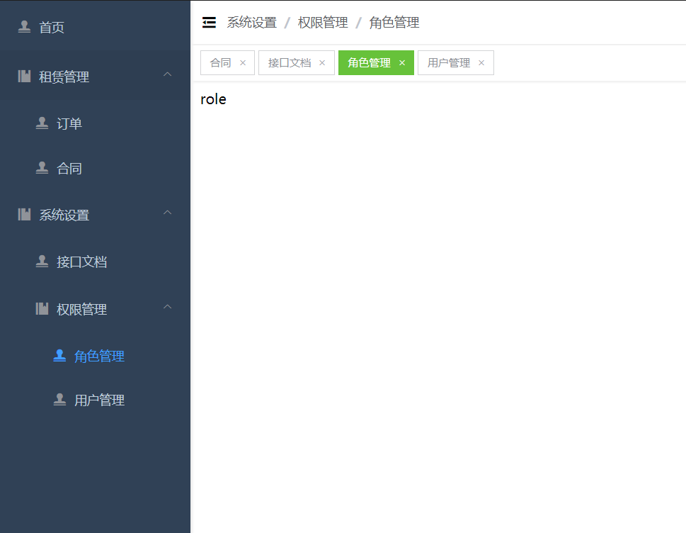

# vue3-typescript-element-admin

技术栈：vue3 + typescript + element-plus


## 注意

- 如果 vue-cli 的版本低于 4.5.9 需要先更新到最新版本

```
npm install -g @vue/cli
```

- 如果没有安装 yarn

```
安装依赖
```

npm install

```
本地启动
```

打包

```
npm run build
```

### yarn

安装依赖

```
yarn install
```

本地启动

```
yarn serve
```

打包

```
yarn build
```
