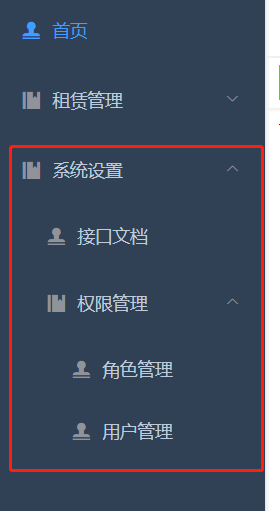

# vue3-typescript-element-admin

技术栈：vue3 + typescript + element-plus

## 项目预览

> 自己买的阿里云服务器速度有点慢

- 项目预览 <a href="http://jddk.ren:8088" target="_blank">项目线上预览</a>
- 项目文档<a href="http://jddk.ren:8089" target="_blank">项目文档线上预览</a>

## 注意

如果 vue-cli 的版本低于 4.5.9 需要先更新到最新版本

```
npm install -g @vue/cli
```

### 介绍

> 本项目参考 vue-element-admin 项目开发 https://panjiachen.github.io/vue-element-admin-site/zh/guide/

vue3-typescript-element-admin 是一个后台前端解决方案，它基于 vue3、typescript 和 element-plus 实现。
它使用了最新的前端技术栈，

### 目录结构

```bash
├── doc # 项目文档,采用docsify
├── public                     # 静态资源
│   │── favicon.ico            # favicon图标
│   └── index.html             # html模板
├── src                        # 源代码
│   ├── assets                 # 主题 字体等静态资源
│   ├── components             # 全局公用组件
│   ├── icons                  # 项目所有 svg icons
│   ├── layout                 # 全局 layout
│   ├── router                 # 路由
│   ├── views                  # views 所有页面
│   ├── App.vue                # 入口页面
│   └── main.js                # 入口文件 加载组件 初始化等
├── tests                      # 测试
├── .env.dev                   # 开发环境变量
└── .env.prod                  # 生产环境变量
```

### 安装

```
# 克隆项目
git clone https://github.com/jddk/vue3-typescript-element-admin

# 进入项目目录
cd vue3-typescript-element-admin

# 安装依赖
npm install

# 建议不要用 cnpm 安装 会有各种诡异的bug 可以通过如下操作解决 npm 下载速度慢的问题
npm install --registry=https://registry.npm.taobao.org

# 本地开发 启动项目
npm run serve
```

## 路由和侧边栏

路由和侧边栏是组织起一个后台应用的关键骨架。

本项目侧边栏和路由是绑定在一起的，所以你只有在 @/router/router.ts 下面配置对应的路由，侧边栏就能动态的生成了。大大减轻了手动重复编辑侧边栏的工作量。当然这样就需要在配置路由的时候遵循一些约定的规则。

## 配置

```javascript
{
  path: "/home",  // 路径
  name: "home",  // 因为<keep-alive>的需要，name必须与.vue文件里的name一致
  meta: {
    title: "首页", // 设置该路由在侧边栏和面包屑中展示的名字
    icon: "index", // 设置该路由的图标
    affix: true, // 如果设置为true，它则会固定在tags-view中(默认 false)
    noCache: true // 如果设置为true，则不会被 <keep-alive> 缓存(默认 false)
    parent: null // 父级的name,这个parent非常重要，内部会根据父级的name将一维数组转换为树结构的菜单
  }
},
```

## 示例

如下多级菜单的路由是这样的,Layout/menu.vue 中获取到 route 数组，根据 parent 来转化成树结构。



```javascript
  {
    path: "/setting",
    name: "setting",
    component: () => import("./Empty.vue"), //里面是空的，实现侧边栏菜单需要
    meta: { title: "系统设置" }
  },
  {
    path: "/setting/webApi",
    name: "webApi",
    component: () => import("@/views/setting/webApi/webApi.vue"),
    meta: { title: "接口文档", parent: "setting" }
  },
  {
    path: "/setting/permission",
    name: "permission",
    component: () => import("./Empty.vue"), //里面是空的，实现侧边栏菜单需要
    meta: { title: "权限管理", parent: "setting", noCache: true }
  },
  {
    path: "/setting/permission/role",
    name: "role",
    component: () => import("@/views/setting/permission/role/role.vue"),
    meta: { title: "角色管理", parent: "permission" }
  },
  {
    path: "/setting/permission/user",
    name: "user",
    component: () => import("@/views/setting/permission/user/user.vue"),
    meta: { title: "用户管理", parent: "permission" }
  }
```

## 多级目录（嵌套路由）

> vue-element-admin 中采用的方案是路由本身就是一个树结构，有三级路由嵌套的情况下，要手动在二级的根文件下添加一个<router-view>,
> 有多少级路由嵌套就需要多少个<router-view>，在实际的开发中发现这个方式有一个 bug，三级及以上路由嵌套 keep-alive 缓存逻辑是不生效的，因为每个多级目录的 component 指向同一个.vue，就可以做到不同的多级目录之间共享 keep-alive，但是它们与根目录之间还是不能共享 keep-alive。即只有同一个 router-view 之间才能共享 keep-alive

现采用的方案，route 中用一维数组，根据 meta 里的 parent 将一维数组转为树结构用于菜单展示。

## 标签栏导航

标签导航的组件在 Layout/nav.vue 中,初始化时添加一次标签，监听路由变化添加标签并向 keep-alive 的 include 中添加需要缓存的组件名称；点击关闭标签时，
移除标签并向 keep-alive 的 include 中添加组件名，因为全局只用了一个 Layout，只会初始化一次所有这些逻辑没有放在 vuex 中，Layout 内部组件之间通讯采用
发布订阅通讯(Bus)。

```javascript
// 监听路由变化
onBeforeRouteUpdate((to: any) => {
  addTags(to);
});

// 初始化时添加路由标签
onMounted(() => {
  addTags(route);
});
```
